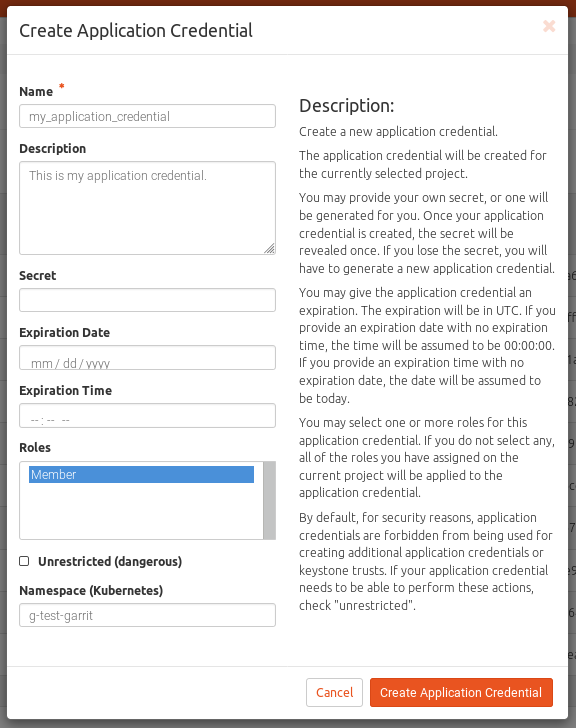
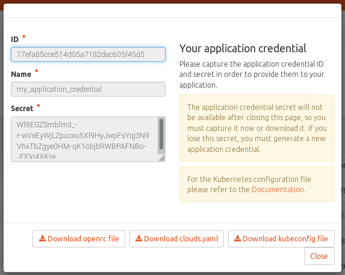

=========================================================
Horizon Dashboard customization module for the GARR Cloud
=========================================================

This Python module customizes the OpenStack Rocky Horizon dashboard by
following the approach described in:

https://docs.openstack.org/horizon/latest/configuration/customizing.html

i.e. monkey patching the existing modules.

https://stackoverflow.com/questions/10027232/how-to-overwrite-a-imported-python-class-for-all-calls

In particular, this module modifies the behaviour of the application
credentials creation: it introduces a field where the user can select a
kubernetes namespace and a button to download a pre-compiled kubernetes
configuration file.

Screenshots
-----------

